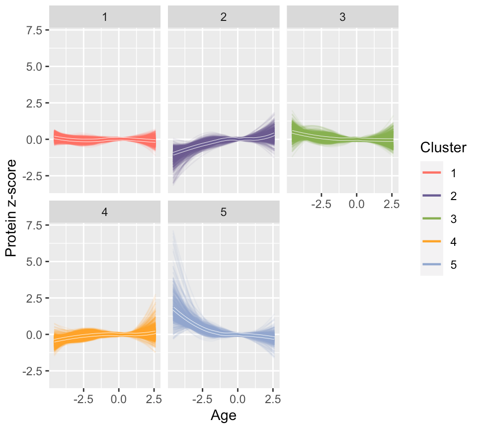

# loessclust

A R Package for analyzing time series data using LOESS interpolation and hierarchical clustering.

## Example usage

Although the package is designed for time series data, it doesn't necessarily have to be time series, and it also doesn't have to be sampled at regular intervals. For instance, in this case, we have analyzed the effect of age on the expression level of 7,348 proteins in the plasma, using a sample size of 450, as in the figure below.

{width = 50%}

## Setup

The package hasn't been released on CRAN yet, so it has to be downloaded from Github.

## Development
